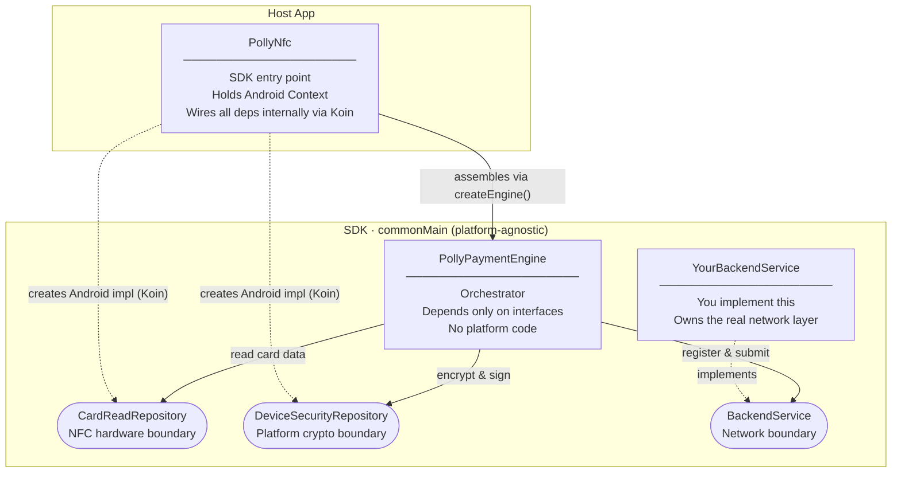
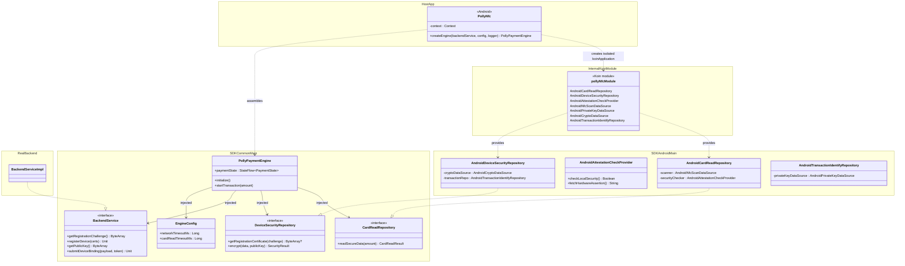

# PollySoftNfc SDK

A Kotlin Multiplatform SDK that turns any Android device into an NFC payment terminal — no dedicated hardware required.

> **Platform support:** Android (full). iOS scaffolding exists; security and NFC integrations are not yet implemented.

---

## Overview

### Who is this for?

This SDK is designed for **merchants** who want to accept contactless payments using an ordinary Android phone or tablet, without buying a dedicated POS terminal.

### How does it work?

The **customer** experience is completely unchanged — they pay exactly as they would with Google Pay or Apple Pay: open their wallet app, tap their phone or card, done.

The **merchant** simply opens their own app (which integrates this SDK) and the device is ready to receive the payment over NFC. No extra hardware needed.

```
Customer                    Merchant's Android Device
   │                                │
   │  opens Google / Apple Pay      │  opens merchant app
   │  selects amount to pay         │  (PollySoftNfc SDK inside)
   │                                │
   │ ── taps phone / card ─────────▶│ reads NFC, encrypts data,
   │                                │ verifies device integrity,
   │                                │ submits to backend
   │                                │
   │                         Payment confirmed
```

### What does the SDK handle?

| Concern | Status |
|---|---|
| NFC card reading | Architecture ready; APDU exchange mocked for demo |
| Root & debugger detection | Real — binary path scan + build-tag check + `FLAG_DEBUGGABLE` |
| Google Play Integrity | Real — `IntegrityManagerFactory` with per-transaction `SecureRandom` nonce |
| End-to-end encryption (RSA-OAEP / SHA-256) | Real — hardware-backed Android Keystore |
| Transaction signing (SHA256withRSA) | Real — hardware-backed Android Keystore |
| Timeout & cancellation | Real — configurable via `EngineConfig`; `CancellationException` propagated correctly |
| Payment state machine | Real — sealed `PaymentState` hierarchy with typed failure subtypes |
| Unit tests (state machine, error paths, sensitive data cleanup) | Real — 30+ test cases |
| Backend communication | **You implement** `BackendService` |

---

## Tech Stack

| Layer | Technology |
|---|---|
| Language | Kotlin 2.3.20 |
| Multiplatform | Kotlin Multiplatform Mobile (KMM) |
| UI (demo app) | Compose Multiplatform 1.10.3 |
| Async | Kotlin Coroutines 1.10.2 |
| Internal DI | Koin 4.0.0 (isolated `koinApplication` — invisible to host app) |
| Encryption | Android Keystore (RSA-OAEP / SHA-256) |
| Signing | SHA256withRSA via Android Keystore |
| Device integrity | Google Play Integrity API 1.4.0 |
| Local security | Root detection, debugger detection |
| Key storage | AndroidKeyStore (hardware-backed, non-exportable) |
| Build system | Gradle 8.14.3 (Kotlin DSL) |
| Min SDK | Android API 30 |
| Target SDK | Android API 36 |
| Publishing | GitHub Packages (Maven) |
| CI/CD | GitHub Actions |

---

## Architecture

### Part 1 — Responsibility of Objects



---

### Part 2 — Dependency Injection Diagram

All internal wiring is handled by an isolated `koinApplication` instance created inside `PollyNfc`. The host app never interacts with Koin directly.



### Module Layout

```
PollySoftNfc-SDK/
├── shared/                         # SDK library (published to GitHub Packages)
│   └── src/
│       ├── commonMain/             # Engine + interfaces (platform-agnostic)
│       │   └── ...nfckmp/
│       │       ├── PollyNfc.kt         # expect entry point
│       │       ├── PollyPaymentEngine.kt
│       │       ├── EngineConfig.kt
│       │       ├── model/              # PaymentState, CardReadResult, SecurityResult …
│       │       ├── network/            # BackendService interface
│       │       ├── nfc_provider/       # CardReadRepository interface
│       │       └── security/           # DeviceSecurityRepository interface
│       ├── androidMain/            # Concrete implementations
│       │   └── ...nfckmp/
│       │       ├── PollyNfc.android.kt # actual — wires deps via Koin
│       │       ├── di/PollyNfcModule.kt
│       │       ├── nfc_provider/       # AndroidCardReadRepository, NfcScanDataSource
│       │       └── security/           # Keystore, crypto, attestation, Play Integrity
│       └── iosMain/                # iOS stubs (not yet implemented)
├── composeApp/                     # Demo Android app
├── iosApp/                         # iOS app wrapper (Xcode)
└── .github/workflows/publish.yml  # CI: publishes on version tags
```

---

## Security Architecture

The SDK is designed around the principle that **plaintext card data never leaves the device**. The layers below map directly to common PCI P2PE concepts, even though this project does not claim PCI certification.

| Layer | Mechanism | Implementation |
|---|---|---|
| Key isolation | Hardware-backed RSA key | Android Keystore — key material is non-exportable and lives in the Secure Element |
| Device attestation | Certificate chain bound to a challenge | `KeyGenParameterSpec.setAttestationChallenge()` — backend verifies the chain against Google's root CA |
| P2PE encryption | RSA-OAEP (SHA-256 / MGF1-SHA-256) | Card data is encrypted on-device with the backend's public key before any network call |
| Payload signing | SHA256withRSA | Encrypted payload is signed with the device's private key so the backend can verify origin |
| Device integrity | Root + debugger detection + Play Integrity | Local checks run before every NFC read; Play Integrity token is verified server-side |
| Sensitive data lifecycle | Explicit memory zeroing | `ByteArray.fill(0)` on raw card data, public key, and `SecurePayload` immediately after use — regardless of success or failure |

### Play Integrity flow

```
AndroidAttestationCheckProvider          Google Play Integrity API
         │                                          │
         │── requestIntegrityToken(nonce) ─────────▶│
         │   (nonce = SecureRandom 24 bytes,        │
         │    Base64 URL-safe encoded)               │
         │◀─ signed JWT ─────────────────────────── │
         │                                           │
         └── integrityToken ──▶ BackendService.submitDeviceBinding()
                                        │
                               [your backend verifies
                                token with Google API
                                before processing payment]
```

---

## Business Logic Workflow

The engine operates in two distinct stages: **Initialization** and **Transaction**.

### Stage 1 — Device Initialization

```
Host App                 PollyPaymentEngine              Backend
    │                           │                           │
    │──── initialize() ────────▶│                           │
    │                           │── getRegistrationChallenge() ▶│
    │                           │◀─ challenge ──────────────│
    │                           │                           │
    │                           │  [generate RSA key pair   │
    │                           │   in Android Keystore     │
    │                           │   bound to challenge]     │
    │                           │                           │
    │                           │── registerDevice() ──────▶│
    │                           │   (certificate chain)     │
    │◀── PaymentState.Idle ─────│◀─ 200 OK ─────────────────│
```

1. Fetch a one-time challenge from the backend.
2. Generate a hardware-backed RSA key pair in the Android Keystore, bound to the challenge.
3. Produce an attestation certificate chain proving the key lives in secure hardware.
4. Register the device; the backend verifies the chain against Google's root CA.

---

### Stage 2 — Payment Transaction

```
Host App             PollyPaymentEngine        Card (NFC)       Backend
    │                        │                     │                │
    │── startTransaction() ─▶│                     │                │
    │                        │── getPublicKey() ──────────────────▶│
    │◀─ WaitingForCard ──────│◀────────────── backendPubKey ───────│
    │                        │                     │                │
    │                        │  [root / debugger   │                │
    │                        │   check]            │                │
    │                        │── fetchHardwareAssertion() ─▶ Play Integrity API
    │                        │◀─────────────── integrityToken ──────│
    │                        │                     │                │
    │                        │◀──── NFC tap ───────│                │
    │◀─ Communicating ───────│   [read card data   │                │
    │                        │    via APDU]        │                │
    │                        │                     │                │
    │                        │  [encrypt with      │                │
    │                        │   RSA-OAEP]         │                │
    │                        │  [sign with         │                │
    │                        │   SHA256withRSA]    │                │
    │                        │  [zero rawData &    │                │
    │                        │   publicKey]        │                │
    │                        │                     │                │
    │                        │── submitDeviceBinding() ────────────▶│
    │◀─ Success / Failed ────│◀──────────────────────── result ────│
    │                        │  [zero SecurePayload]│               │
```

### Payment States

```
PaymentState
├── Idle                        # Ready; initialization complete
├── Initializing                # Fetching challenge / registering device
├── WaitingForCard              # NFC listener active, waiting for tap
├── Communicating               # Encrypting & submitting to backend
├── Success                     # Transaction accepted by backend
└── Failed
    ├── NotInitialized          # startTransaction called before initialize
    ├── LocalSecurityFailed     # Root/debugger detected, key attestation unavailable,
    │                           # or encryption error
    ├── BackendError(message)   # Network error or backend rejection
    └── TimedOut                # A step exceeded EngineConfig timeout
```

---

## Installation

### 1. Add the GitHub Packages repository

In your project-level `settings.gradle.kts`:

```kotlin
dependencyResolutionManagement {
    repositories {
        google()
        mavenCentral()
        maven {
            name = "GitHubPackages"
            url = uri("https://maven.pkg.github.com/pollyannaanalytics/PollySoftNfc-SDK")
            credentials {
                username = providers.gradleProperty("gpr.user").orNull
                    ?: System.getenv("GITHUB_ACTOR")
                password = providers.gradleProperty("gpr.token").orNull
                    ?: System.getenv("GITHUB_TOKEN")
            }
        }
    }
}
```

### 2. Add credentials

GitHub Packages requires authentication even for public packages. Add your credentials to `~/.gradle/gradle.properties`:

```properties
gpr.user=YOUR_GITHUB_USERNAME
gpr.token=YOUR_GITHUB_PERSONAL_ACCESS_TOKEN
```

The token needs at least the `read:packages` scope.

### 3. Add the dependency

In your app-level `build.gradle.kts`:

```kotlin
dependencies {
    implementation("org.pollyanna:shared:0.1.2")
}
```

### 4. Add NFC permission

In your `AndroidManifest.xml`:

```xml
<uses-permission android:name="android.permission.NFC" />
<uses-feature android:name="android.hardware.nfc" android:required="true" />
```

---

## Usage

### Step 1 — Implement BackendService

The only interface you must implement is `BackendService`, which connects the SDK to your own server. A `MockBackendService` is included for local testing and development.

| Method | Called when | What to do on your backend |
|---|---|---|
| `getRegistrationChallenge()` | Device init starts | Generate a cryptographically random nonce; store it for later verification |
| `registerDevice(certificateChain)` | After key generation | Parse & verify the DER-encoded X.509 chain against Google's root CA; store the leaf cert |
| `getPublicKey()` | Start of every transaction | Return your server's RSA public key (DER-encoded SubjectPublicKeyInfo) |
| `submitDeviceBinding(payload, integrityToken)` | After card data is encrypted | Verify `integrityToken` with Google Play Integrity API; decrypt `payload.encryptedData`; verify `payload.signature` against the stored device cert; forward to payment processor |

### Step 2 — Create the engine

```kotlin
// 1. Create via PollyNfc — all internal wiring is handled automatically
val engine = PollyNfc(context)
    .createEngine(backendService = YourBackendServiceImpl())

// Optional: tune timeouts
val engine = PollyNfc(context)
    .createEngine(
        backendService = YourBackendServiceImpl(),
        config = EngineConfig(
            networkTimeoutMs = 15_000L,   // default: 30 s
            cardReadTimeoutMs = 30_000L,  // default: 60 s
        ),
        logger = PollyLogger.Silent,      // suppress SDK logs in production
    )
```

### Step 3 — Observe state and run transactions

```kotlin
// Observe payment state (e.g. inside a ViewModel)
lifecycleScope.launch {
    engine.paymentState.collect { state ->
        when (state) {
            is PaymentState.Idle             -> showReadyUI()
            is PaymentState.Initializing     -> showLoadingUI()
            is PaymentState.WaitingForCard   -> showTapCardPrompt()
            is PaymentState.Communicating    -> showLoadingUI()
            is PaymentState.Success          -> showSuccess()
            is PaymentState.Failed.NotInitialized   -> showError("Please initialize first")
            is PaymentState.Failed.LocalSecurityFailed -> showError("Device security check failed")
            is PaymentState.Failed.BackendError -> showError(state.message)
            is PaymentState.Failed.TimedOut  -> showError("Request timed out — please try again")
        }
    }
}

// Initialize once (e.g. on app start or ViewModel init)
lifecycleScope.launch { engine.initialize() }

// Start a transaction when the merchant is ready to accept payment
lifecycleScope.launch { engine.startTransaction(amount = 49.99) }
```

### ViewModel integration

```kotlin
class PaymentViewModel(application: Application) : AndroidViewModel(application) {
    private val engine = PollyNfc(application)
        .createEngine(backendService = YourBackendServiceImpl())

    val paymentState = engine.paymentState   // expose as StateFlow to the UI

    fun initialize() = viewModelScope.launch { engine.initialize() }
    fun pay(amount: Double) = viewModelScope.launch { engine.startTransaction(amount) }
}
```

---

## Publishing

A new version is published to GitHub Packages automatically when a version tag is pushed:

```bash
git tag v0.1.2
git push origin v0.1.2
```

The workflow (`.github/workflows/publish.yml`) builds and publishes the `:shared` module to:
`https://maven.pkg.github.com/pollyannaanalytics/PollySoftNfc-SDK`
