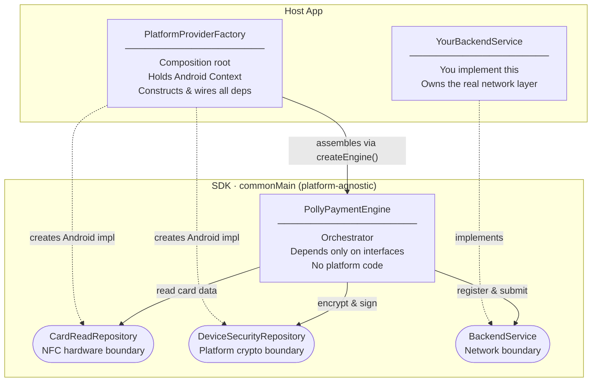
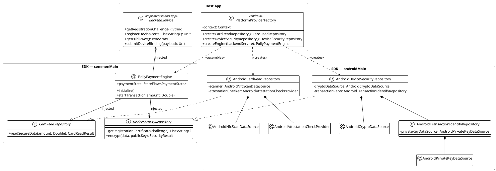

# PollySoftNfc SDK

A Kotlin Multiplatform SDK for secure NFC-based contactless payment processing. It handles card reading, device attestation, end-to-end encryption, and backend submission — all behind a simple state-driven API.

> **Platform support:** Android only. iOS scaffolding exists but security and NFC integrations are not yet implemented.

---

## Tech Stack

| Layer | Technology |
|---|---|
| Language | Kotlin 2.3.20 |
| Multiplatform | Kotlin Multiplatform Mobile (KMM) |
| UI (demo app) | Compose Multiplatform 1.10.3 |
| Async | Kotlin Coroutines 1.10.2 |
| Encryption | Android Keystore (RSA/OAEP SHA-256) |
| Signing | SHA256withRSA via Android Keystore |
| Security | Root detection, debugger detection, Play Integrity API |
| Key storage | AndroidKeyStore (hardware-backed) |
| Build system | Gradle 8.14.3 (Kotlin DSL) |
| Min SDK | Android API 30 |
| Target SDK | Android API 36 |
| Publishing | GitHub Packages (Maven) |
| CI/CD | GitHub Actions |

---

## Architecture

### Part 1 — Responsibility of Objects



---

### Part 2 — Dependency Injection Diagram (PlantUML)



> Render with [PlantUML](https://plantuml.com) or paste the block into the [online editor](https://www.plantuml.com/plantuml).

### Module Layout

```
PollySoftNfc-SDK/
├── shared/                         # SDK library (published to GitHub Packages)
│   └── src/
│       ├── commonMain/             # Engine + interfaces (platform-agnostic)
│       ├── androidMain/            # Concrete implementations (NFC, Keystore, crypto)
│       └── iosMain/                # iOS stubs (not yet implemented)
├── composeApp/                     # Demo Android app
├── iosApp/                         # iOS app wrapper (Xcode)
└── .github/workflows/publish.yml  # CI: publishes on version tags
```

---

## Business Logic Workflow

The engine operates in two distinct stages: **Initialization** and **Transaction**.

### Stage 1 — Device Initialization

```
Host App                 PollyPaymentEngine              Backend
    │                           │                           │
    │──── initialize() ────────▶│                           │
    │                           │── fetchChallenge() ──────▶│
    │                           │◀─ challenge ──────────────│
    │                           │                           │
    │                           │  [generate RSA key pair   │
    │                           │   in Android Keystore     │
    │                           │   with hardware attest]   │
    │                           │                           │
    │                           │── registerDevice() ──────▶│
    │                           │   (certificate chain)     │
    │◀── PaymentState.Idle ─────│◀─ accessToken ────────────│
```

1. Fetch a one-time challenge from the backend.
2. Generate a hardware-backed RSA key pair in the Android Keystore.
3. Produce an attestation certificate chain proving the key lives in secure hardware.
4. Register the device with the backend; receive an access token.

---

### Stage 2 — Payment Transaction

```
Host App             PollyPaymentEngine        Card (NFC)       Backend
    │                        │                     │                │
    │── startTransaction() ─▶│                     │                │
    │                        │── fetchPublicKey() ────────────────▶│
    │◀─ WaitingForCard ──────│◀────────────────── backendPubKey ───│
    │                        │                     │                │
    │                        │◀──── NFC tap ───────│                │
    │◀─ Communicating ───────│   [read card data   │                │
    │                        │    via APDU]        │                │
    │                        │                     │                │
    │                        │  [security checks:  │                │
    │                        │   root, debugger]   │                │
    │                        │                     │                │
    │                        │  [encrypt card data │                │
    │                        │   with backend pub  │                │
    │                        │   key (RSA/OAEP)]   │                │
    │                        │                     │                │
    │                        │  [sign payload with │                │
    │                        │   device private key│                │
    │                        │   (SHA256withRSA)]  │                │
    │                        │                     │                │
    │                        │── submitTransaction() ─────────────▶│
    │◀─ Success / Failed ────│◀──────────────────────── result ────│
```

### Payment States

```
PaymentState
├── Idle                        # Ready; initialization complete
├── Initializing                # Fetching challenge / registering device
├── WaitingForCard              # NFC listener active, waiting for tap
├── Communicating               # Encrypting & submitting to backend
├── Success                     # Transaction accepted by backend
└── Failed
    ├── NotInitialized          # startTransaction called before initialize
    ├── LocalSecurityFailed     # Root/debugger detected, or encryption error
    └── BackendError(message)   # Network or backend rejection
```

---

## Installation (Android Only)

### 1. Add GitHub Packages repository

In your project-level `settings.gradle.kts`, add the Maven repository:

```kotlin
dependencyResolutionManagement {
    repositories {
        google()
        mavenCentral()
        maven {
            name = "GitHubPackages"
            url = uri("https://maven.pkg.github.com/pollyannaanalytics/PollySoftNfc-SDK")
            credentials {
                username = providers.gradleProperty("gpr.user").orNull
                    ?: System.getenv("GITHUB_ACTOR")
                password = providers.gradleProperty("gpr.token").orNull
                    ?: System.getenv("GITHUB_TOKEN")
            }
        }
    }
}
```

### 2. Add credentials

GitHub Packages requires authentication even for public packages. Add your credentials to `~/.gradle/gradle.properties`:

```properties
gpr.user=YOUR_GITHUB_USERNAME
gpr.token=YOUR_GITHUB_PERSONAL_ACCESS_TOKEN
```

The token needs at least the `read:packages` scope.

### 3. Add the dependency

In your app-level `build.gradle.kts`:

```kotlin
dependencies {
    implementation("org.pollyanna:shared:0.1.0")
}
```

### 4. Add NFC permission

In your `AndroidManifest.xml`:

```xml
<uses-permission android:name="android.permission.NFC" />
<uses-feature android:name="android.hardware.nfc" android:required="true" />
```

### 5. Usage

```kotlin
import org.pollyanna.nfckmp.PollyPaymentEngine
import org.pollyanna.nfckmp.nfc_provider.PlatformProviderFactory
import org.pollyanna.nfckmp.nfc_provider.createEngine

// In your Activity or ViewModel
val factory = PlatformProviderFactory(context)
val engine = factory.createEngine(backendService = YourBackendServiceImpl())

// Observe state
lifecycleScope.launch {
    engine.paymentState.collect { state ->
        when (state) {
            is PaymentState.Idle           -> showReadyUI()
            is PaymentState.WaitingForCard -> showTapCardPrompt()
            is PaymentState.Communicating  -> showLoadingUI()
            is PaymentState.Success        -> showSuccess()
            is PaymentState.Failed         -> showError(state)
            else                           -> Unit
        }
    }
}

// Initialize once (e.g. on app start)
lifecycleScope.launch {
    engine.initialize()
}

// Start a transaction
lifecycleScope.launch {
    engine.startTransaction(amount = 49.99)
}
```

You must implement the `BackendService` interface to connect the SDK to your own server:

```kotlin
interface BackendService {
    suspend fun fetchChallenge(): String
    suspend fun registerDevice(certificateChain: List<String>): String   // returns access token
    suspend fun fetchBackendPublicKey(): String
    suspend fun submitTransaction(request: TransactionRequest): Boolean
}
```

A `MockBackendService` is included for local testing and development.

---

## Publishing

A new version is published to GitHub Packages automatically when a version tag is pushed:

```bash
git tag v1.0.0
git push origin v1.0.0
```

The workflow (`.github/workflows/publish.yml`) builds and publishes the `:shared` module to:
`https://maven.pkg.github.com/pollyannaanalytics/PollySoftNfc-SDK`
